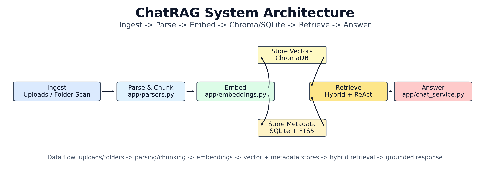
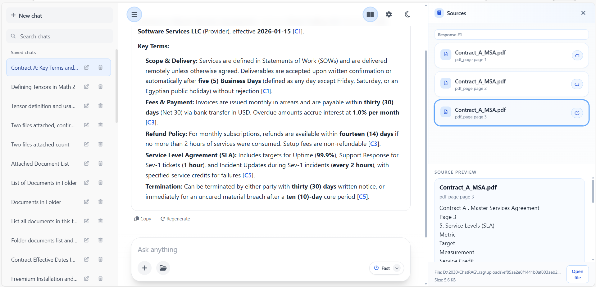
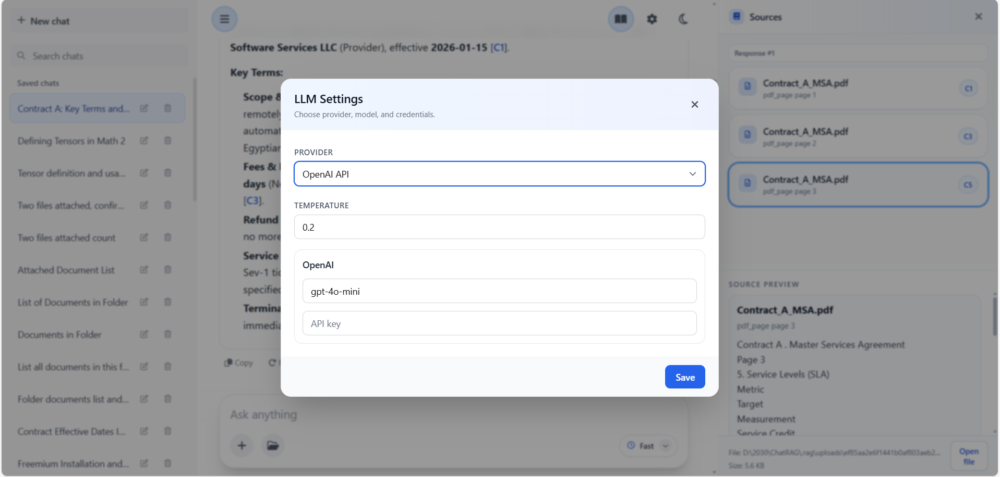
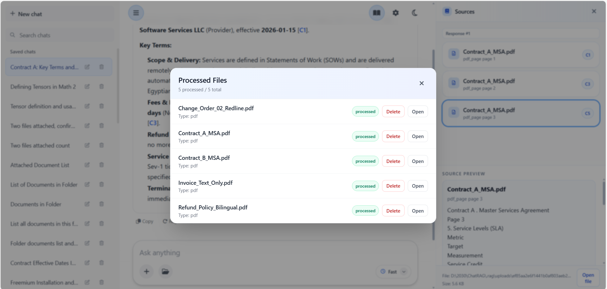
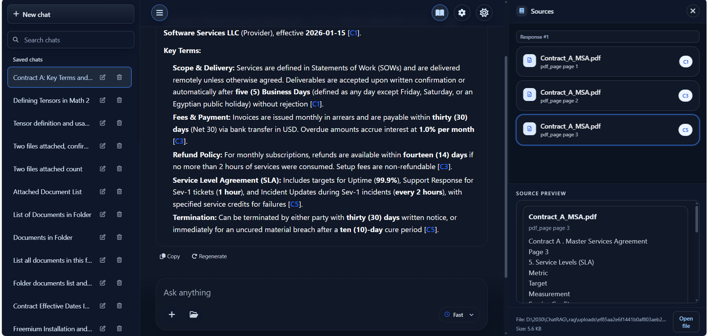
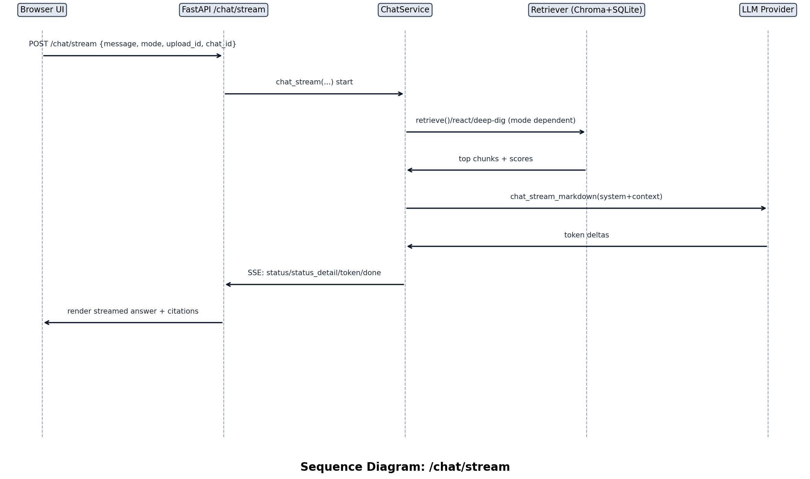
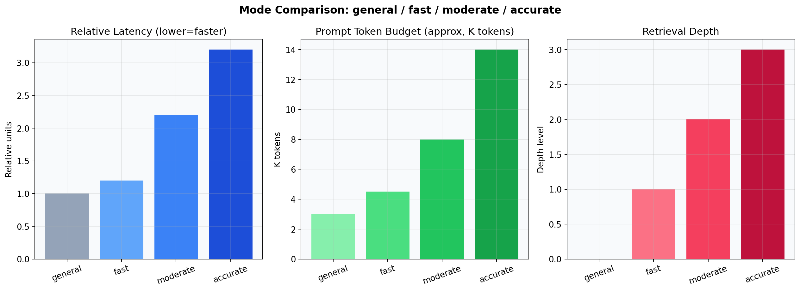
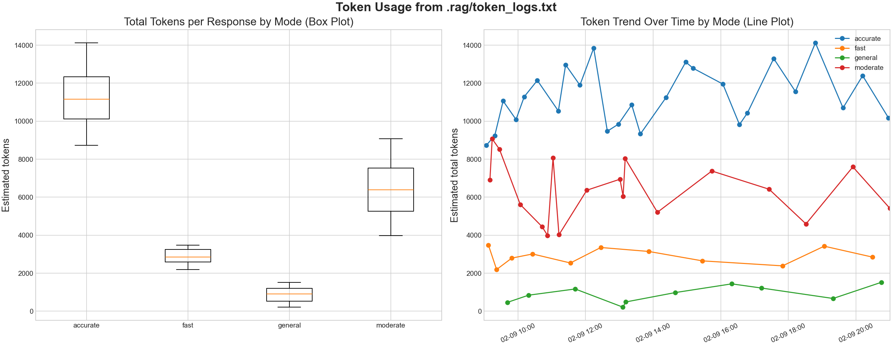
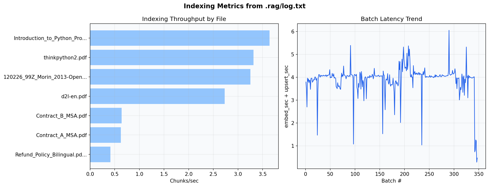

# ChatRAG

[](LICENSE)

Local-first RAG chat app for multi-document QA with grounded citations.

## Non-technical install (Windows)

If you don’t want to install Python or run commands, download the full app bundle here:

- **Download:** https://drive.google.com/file/d/15EPHrKbuD8ckSqCnVGd3qzSxzMfbo4AH/view?usp=sharing

### How to run
1. Download the ZIP
2. Extract it (right click. Extract All)
3. Open the extracted folder
4. Double click **ChatRAG.bat**

That’s it. A window will open and start the app.

### Optional. Use Ollama for local models
If you want to run models locally (no cloud), install Ollama first:

- **Download Ollama (Windows):** https://ollama.com/download/windows

Then you can pick **Provider runtime: `ollama`** inside ChatRAG.

- **Model parameters (size):** A “7B” model has ~7 billion parameters. Bigger models (e.g., 13B, 70B) usually provide better reasoning and text quality, but require more RAM/VRAM and may run slower on typical PCs.

### If Windows blocks it
If you see “Windows protected your PC”, click **More info**. **Run anyway**.

## Highlights
- Local indexing for `.pdf`, `.docx`, `.pptx`, `.txt`, `.md`
- Hybrid retrieval: dense vectors (ChromaDB) + lexical search (SQLite FTS5)
- Four modes: `general`, `fast`, `moderate`, `accurate`
- Provider runtime: `ollama` (default), `openai`, `deepseek`
- Token and indexing observability via `.rag/token_logs.txt` and `.rag/log.txt`

## Limitations and Not Supported
- No support for `.csv`, `.xlsx`, or `.xls` indexing.
- No OCR pipeline is included. Image-only/scanned PDFs and images with text may not be searchable.
- Table-heavy documents are only partially reliable:
  - `.docx` tables are parsed, but complex merged/nested layouts can still lose structure.
  - PDF table extraction depends on PDF text layout and can be incomplete or out of order.
- No internet/web crawling ingestion. Indexing is local files only.
- No guaranteed "full document understanding"; retrieval quality depends on chunking, extraction quality, and query wording.
- Cached indexing can hide parser changes unless you re-index files after updates.
- Citations are grounded to retrieved chunks only, so answers can be partial if relevant chunks were not extracted/retrieved.
- Very large files/corpora may be slower on low-resource machines; latency depends on model/provider and hardware.

## Modes
- `general`: normal chat, no file retrieval, keeps recent chat memory (up to 80 messages), ignores citation-backed turns for memory context
- `fast`: lowest latency / lowest cost RAG path
- `moderate`: stronger recall with bounded token budget
- `accurate`: deepest retrieval orchestration and highest quality

## Architecture


### Runtime components
- API/server: `app/main.py`
- Orchestration: `app/chat_service.py`
- Indexing worker: `app/indexer.py`
- Parsing/chunking: `app/parsers.py`
- Embeddings: `app/embeddings.py`
- Retrieval: `app/retrieval.py`
- Vector store: `app/vector_store.py` (ChromaDB)
- Metadata/chat store: `app/database.py` (SQLite)

## UI and Diagrams










## Quick Start
### Windows (PowerShell)
```powershell
python -m venv .venv
.venv\Scripts\Activate.ps1
python -m pip install --upgrade pip
pip install -r requirements.txt
python app/main.py
```

### Windows (CMD)
```bat
python -m venv .venv
.venv\Scripts\activate.bat
python -m pip install --upgrade pip
pip install -r requirements.txt
python app/main.py
```

### Linux/macOS
```bash
python3 -m venv .venv
source .venv/bin/activate
python -m pip install --upgrade pip
pip install -r requirements.txt
python app/main.py
```

## Key API Endpoints
### Health and settings
- `GET /health`
- `GET /settings/llm`
- `POST /settings/llm`
- `GET /settings/ollama/models`

### Indexing
- `POST /index`
- `POST /index/upload`
- `POST /index/upload/start`
- `GET /index/status?job_id=...`

### Chat
- `POST /chat`
- `POST /chat/stream`
- `POST /chats`
- `GET /chats`
- `PATCH /chats/{chat_id}`
- `POST /chats/{chat_id}/rename`

## Configuration
Main settings are in `app/config.py`:
- Provider: `LLM_PROVIDER`, `OLLAMA_*`, `OPENAI_*`, `DEEPSEEK_*`
- Retrieval thresholds: `LOW_CONFIDENCE_THRESHOLD`, `HARD_NOT_FOUND_THRESHOLD`
- Embedding/storage: `EMBEDDING_*`, `CHROMA_*`, `SQLITE_PATH`
- Metadata/chat store: `app/database.py` (SQLite)

## Docs
- `docs/architecture.md`
- `docs/benchmarks.md`

## License
This project is licensed under the **Apache License 2.0**.

You may use, modify, and distribute this software, including for commercial purposes, as long as you comply with the terms of the license (e.g., include the required notices and a copy of the license).
