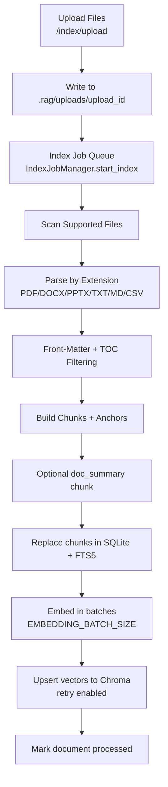
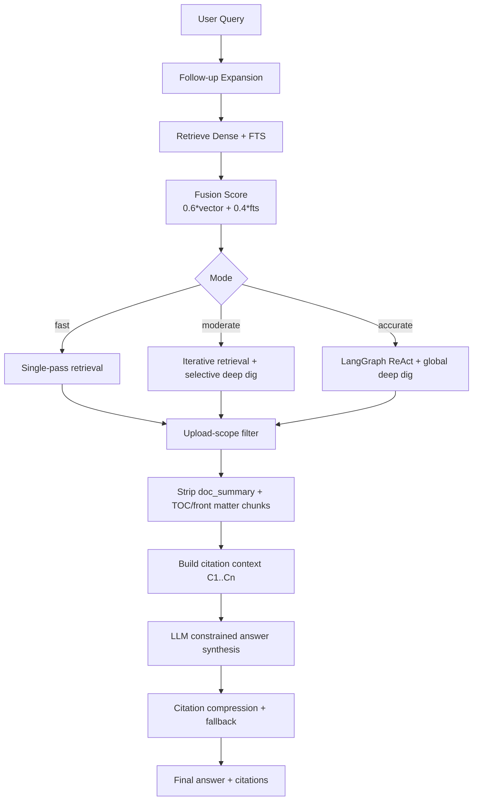
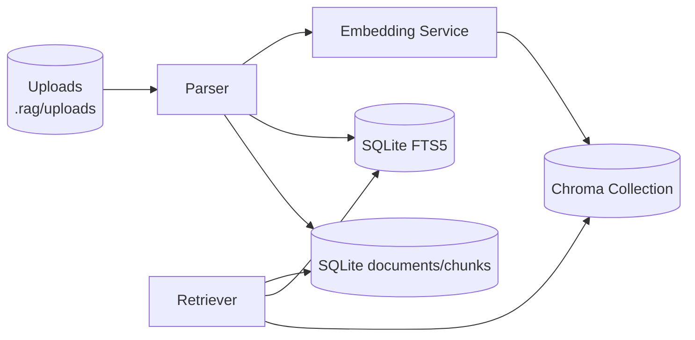

# Architecture

This document provides executable architecture diagrams (Mermaid) and control-flow notes.

## Ingestion and Indexing Pipeline

## Query and Answer Pipeline

## Storage Topology

## Design Notes

- Upload scoping is strict: retrieval results are filtered by `upload_id` to prevent cross-upload leakage.
- Citation generation excludes `doc_summary` and front-matter-like chunks.
- `moderate` and `accurate` use multi-step retrieval orchestration; `fast` uses a single retrieval pass.
